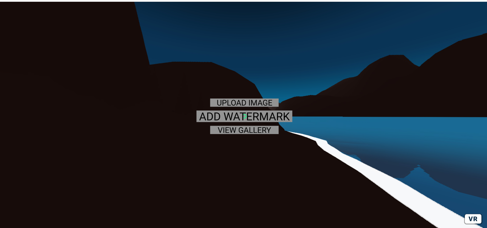
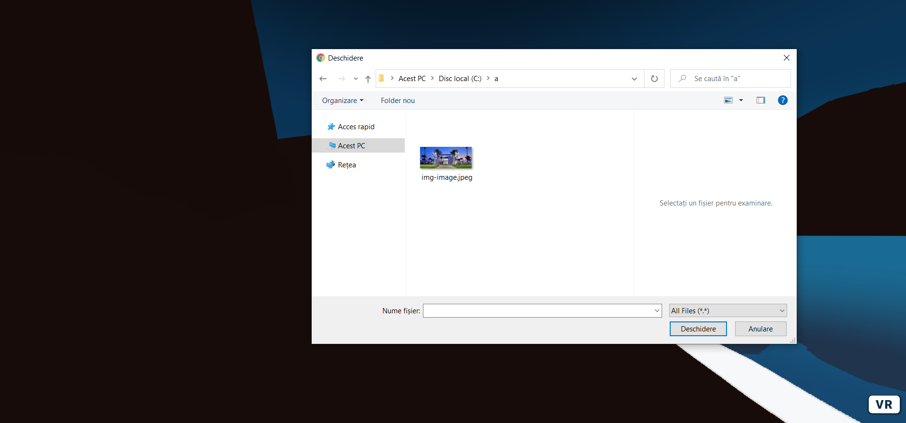
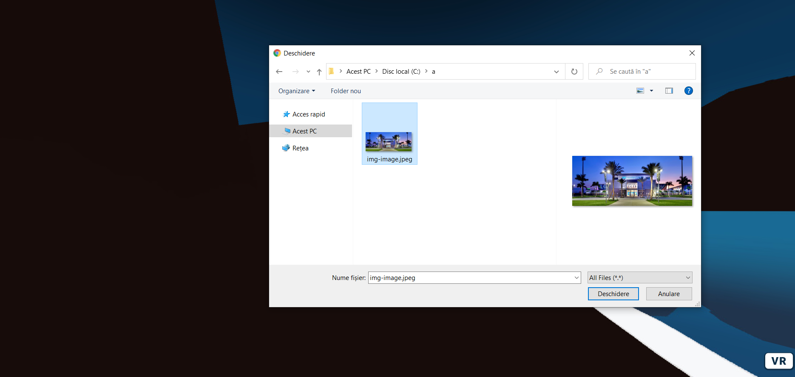
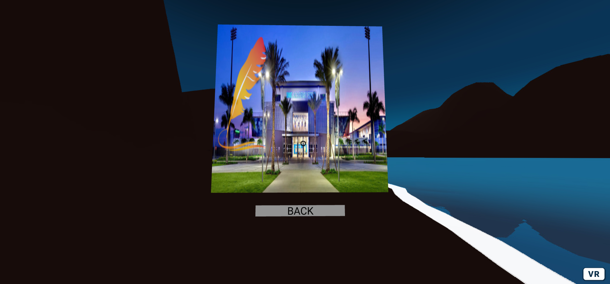
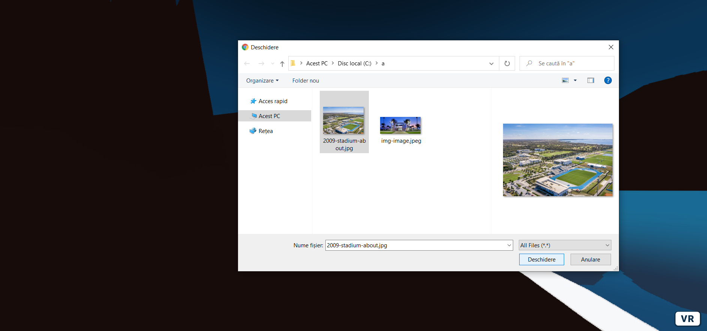
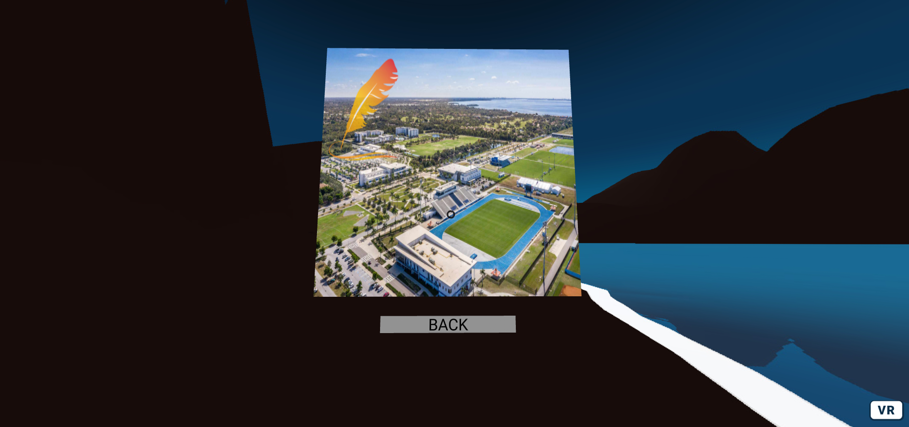

# Sense of Space A-Frame Application written by Andrei


<p align="center">
    
</p>


This project consists of a simple **REST-ful API** backend service in **Node.js** and **Express** 
that servers a couple of views representing the **A-Frame Application**.
The user can upload an image from the local storage when performing the *"upload"*
action. And add a watermark to the image by performing the *"add watermark"* action.
Also the user can view the most recent watermarked image in a simple gallery.
When performing the *"add watermark"* action, the server route *"/addImageWatermark"*
is called, the image is stored on the server using **Multer** node package. The image
is then applied a watermark and overwrites the original image.

<br>

# Demo

#### The project is online:

<h3>

[LIVE DEMO HERE](https://sense-of-space-a-frame-application.glitch.me/)
<br>
<br>

# Features
<h3>

* Upload image 🆙📤⤴
* Add watermark 💧💦📝✒
* View recent galery 👓🖼🖼
<br>
<br>

# Technologies used :
<br>
<h2> 

&nbsp;&nbsp;&nbsp;&nbsp;&nbsp;
* Node Js

&nbsp;&nbsp;&nbsp;&nbsp;&nbsp;
* Express

&nbsp;
* Multer

&nbsp;&nbsp;&nbsp;&nbsp;&nbsp;&nbsp;&nbsp;
* A-Frame  
</br>

# Gallery
<p align="center">
    
</p>
<p align="center">
    
</p>
<p align="center">
    
</p>
<p align="center">
    
</p>
<p align="center">
    
</p>
<p align="center">
    
</p>

</br>

# To run the project locally

## Pre-requisites:
- node installed (e.g. version used: v14.15.1)
- npm installed (e.g. version used: 6.14.8)

## Steps:

1. Clone the repository
2. Open the command line in the project folder.
3. From the command line write the following comands in order:
```
npm i
npm start
```
4. Open your browser and go to the link displayed on the console,
e.g.:
- http://localhost:1234


# Tips:

A few things to consider.
Since hosting the project on Glitch can sometimes be a
little bit..., well..., glitchy...😄
Here are a few tips and things to keep in mind when trying the project in Glitch:
* After you uploaded the image, when you press the 'Add Watermark' button,
wait for the page to finish reloading before continuing
* If you open the gallery and you see the image that you uploaded and watermarked
without an orange feather over the image in the top left corner, then go back and 
reupload the image, and watermark it until the image gets watermarked or try 
uploading a different image
* If you uploaded the image and watermarked it, and you open the gallery 
and you see a black panel, then just refresh the page
* If you have not uploaded and watermarked any image, and you open the gallery,
and you see the black panel, don't worry it's normal, there's just nothing upladed
yet. Just go back, upload and watermark an image.

## Have fun with project and thank you for your attention. 😊😉


